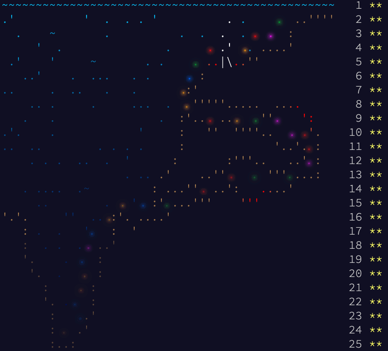

# Overview

My solutions written in Rust and Kotlin for [Advent of Code 2021](https://adventofcode.com/2021).

## Disclaimer

Note that this code is **hacky, not polished or refactored in any way**, i.e. it is probably the worst spaghetti code you can imagine. Its sole purpose was to solve the puzzles, it should not be used
as example for good code. That means, after I retrieved the correct solution for a puzzle, **I left the source code as it is without any cleanup**. Or stated otherwise, **I intentionally gave myself
the permission to hack around...**

| Day | Problem                                            | Topic                                                       |
|-----|----------------------------------------------------|-------------------------------------------------------------|
| 1   | [Sonar Sweep](https://adventofcode.com/2021/day/1) | Slicing window computations                                 |
| 2   | [Dive!](https://adventofcode.com/2021/day/2)       | Parse grid traversal commands                               |
| 3   | [Binary Diagnostic](https://adventofcode.com/2021/day/3) | Binary number computations                                  |
| 4   | [Giant Squid](https://adventofcode.com/2021/day/4) | Array computations                                          |
| 5   | [Hydrothermal Venture](https://adventofcode.com/2021/day/5) | Twodimensional area covering computation                    |
| 6   | [Lanternfish](https://adventofcode.com/2021/day/6) | Exponential modulo computations                             |
| 7   | [The Treachery of Whales](https://adventofcode.com/2021/day/7) | Combinatorial space exploration                             |
| 8   | [Seven Segment Search](https://adventofcode.com/2021/day/8) | Solve mathematical combinatorial equations                  |
| 9   | [Smoke Basin](https://adventofcode.com/2021/day/9) | Path finding using Dijkstra                                 |
| 10  | [Syntax Scoring](https://adventofcode.com/2021/day/10) | Stack-based parser computation                              |
| 11  | [Dumbo Octopus](https://adventofcode.com/2021/day/11) | Cellular automata computations                              |
| 12  | [Passage Pathing](https://adventofcode.com/2021/day/12) | Graph traversal algorithms                                  |
| 13  | [Transparent Origami](https://adventofcode.com/2021/day/13) | Twodimensional folding algorithms                           |
| 14  | [Extended Polymerization](https://adventofcode.com/2021/day/14) | Grammar exploration                                         |
| 15  | [Chiton](https://adventofcode.com/2021/day/15)     | Path finding                                                |
| 16  | [Packet Decoder](https://adventofcode.com/2021/day/16) | Recursive unpacking of binary data structure                |
| 17  | [Trick Shot](https://adventofcode.com/2021/day/17) | Simulating cannon shots                                     |
| 18  | [Snailfish](https://adventofcode.com/2021/day/18)  | Binary tree computations                                    |
| 19  | [Beacon Scanner](https://adventofcode.com/2021/day/19) | Threedimensional combinatorial object to object matching    |
| 20  | [Trench Map](https://adventofcode.com/2021/day/20) | Simulating cellular automata on infinite grid               |
| 21  | [Dirac Dice](https://adventofcode.com/2021/day/21) | Simulating quantum dices using tree search                  |
| 22  | [Reactor Reboot](https://adventofcode.com/2021/day/22) | Intersection cuts in threedimensional space                 |
| 23  | [Amphipod](https://adventofcode.com/2021/day/23) | Minimal cost finding using tree exploration (done by hand!) |
| 24  | [Arithmetic Logic Unit](https://adventofcode.com/2021/day/24) | Reverse-engineering assembly code                           |
| 25  | [Sea Cucumber](https://adventofcode.com/2021/day/25) | Twodimensional cellular simulation with two cell types      | 

